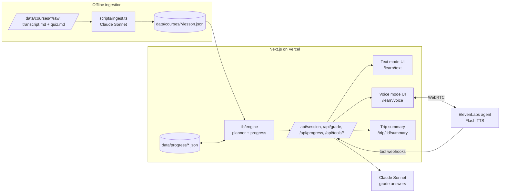

# OUTLINE — commute-sized learning (working name TBD)

**Pitch:** Half of South Africa's workers commute by public transport, and most of them start courses they never finish. We turn the trip into the lesson: hands-free on the N2, silent and low-data in a taxi, picking up mid-sentence where the last leg left off. You arrive with progress, not just an episode.

## 1. Problem

~50% of SA workers commute by public transport, 60–120 min/day. Most online-course starts never finish (MOOC completion ≈ 5–15%). Commute time is dead time; audio courses exist but produce no *progress*: no checkpoints, no resume, no credit. Driving needs hands-free; taxis need silence and low data.

## 2. Solution

Take an existing short course, transpose it offline into commute-sized **segments** (3–5 min) with **checkpoints**. A **session** is a trip: user says how long they've got, the engine plans N segments that fit, and stores a resume pointer. Two front-ends over one engine:

- **Voice mode** (driving): ElevenLabs Conversational AI agent. Barge-in, "repeat / explain differently / skip / go deeper", spoken quiz answers graded by Claude.
- **Text mode** (taxi/bus): same lesson JSON as a lightweight chat UI, tap-to-answer quizzes, mobile-first, low data.

Both write to the same progress store. Every trip ends with a **progress card** (segments done, mastered/weak topics, % of module, streak).

Audio is table stakes. The product is (a) curriculum-to-session transposition, (b) trip-shaped sessions with resume state, (c) a persistent progress artefact.

## 3. Architecture



## 4. Lesson JSON schema (summary — full in SCHEMA.md, code in src/types/lesson.ts)

```
Course { id, title, description, estimatedMinutes, modules: Module[] }
Module { id, title, segments: Segment[] }
Segment {
  id, title, durationSec,            // spoken length, 180–300
  script: string,                    // what the voice says / text shows (plain prose)
  keyPoints: string[],               // 2–4 bullets, used for "repeat"/summary
  altExplanation: string,            // used for "explain differently"
  deeper: string,                    // used for "go deeper"
  checkpoint: Question[]             // 1–3
}
Question { id, prompt, type: "mcq"|"open", options?: string[], answer: string,
           rubric: string, topic: string }   // rubric = what a correct paraphrase must contain

Progress { userId, courseId, segmentsCompleted: string[],
           checkpoints: { questionId, correct, attempt, mode }[],
           topics: { [topic]: { seen, correct } },
           resume: { segmentId, position: "start"|"checkpoint" },
           streakDays, lastTripAt, trips: TripSummary[] }
TripSummary { tripId, startedAt, minutes, mode, segmentIds, correct, total,
              mastered: string[], weak: string[], modulePct }
```

## 5. Session planning algorithm

Trips are open-ended: there is no trip length to pick and no budget. Input: `progress.resume`, `mode`. Output: `Plan { startAt }`.

1. Start at the resume pointer (or first incomplete segment; top of the course if everything is done).
2. The cursor then walks the course in order, part after part, section after section, until the learner ends the trip (or the course runs out).
3. Along the way the tutor says what just finished, by name ("Section two point five, …, done. Next, …", "Chapter two, …, done."), and any milestone the moment it is earned ("Milestone: first hands-free trip."), then keeps reading. Listen mode adds an earcon to each.
4. On each segment/checkpoint completion, write the resume pointer immediately, so a killed trip resumes mid-module next time. Trip end = user says "done" / holds End / taps End trip / course exhausted → generate TripSummary (`minutes` = elapsed).

## 6. Real vs stubbed (demo)

| Real | Stubbed / cut |
|---|---|
| Ingestion via Claude, run once offline | Slides input (transcript + quiz.md only) |
| Text mode, full loop on sample course | Auth — single hard-coded `demo` user |
| Voice mode via ElevenLabs agent, real barge-in | Trip duration = picker, not Maps |
| LLM grading of open answers (Claude) | Multi-course catalogue — one course, one module (4 segments) |
| Planner + resume across modes | Supabase — JSON files on disk (Vercel: `/tmp` + seeded fallback) |
| Trip summary screen | Streak — computed from timestamps, seeded to look alive |

Vercel note: filesystem is read-only except `/tmp`, so the progress store falls back to memory + seeded JSON there. Demo runs on localhost if this bites.

## 7. Build sequence (hours)

| # | Task | Est | Cum |
|---|---|---|---|
| 1 | OUTLINE, SCHEMA, `types/lesson.ts` | 1 | 1 |
| 2 | Scaffold Next.js, Tailwind, scripts, README, .env.example | 1 | 2 |
| 3 | `scripts/ingest.ts` + sample course + committed `lesson.json` | 2 | 4 |
| 4 | Progress store + planner (`lib/engine`) + `/api/*` routes | 2 | 6 |
| 5 | Text mode UI (chat renderer, tap quiz, grade open Qs) | 4 | 10 |
| 6 | ElevenLabs stub: component, tool routes, dashboard doc | 2 | 12 |
| 7 | Voice mode live: agent config, barge-in, commands, grading tool | 5 | 17 |
| 8 | Trip summary screen (the closing beat) | 3 | 20 |
| 9 | Duration picker / trip start flow, resume across modes | 2 | 22 |
| 10 | DEMO.md, rehearsal, polish, deploy | 4 | 26 |
| — | Buffer / sleep | 10 | 36 |

Sample course: "Intro to Personal Finance in SA" (budgeting, interest, credit score, tax basics) — 1 module, 4 segments.
